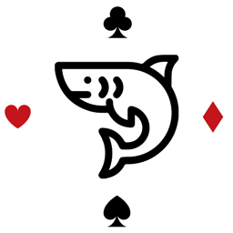

<div id="top"></div>

<!-- PROJECT LOGO -->
<br />
<div align="center">
  <a href="https://github.com/bozoputer/card-shark">
    
  </a>

  <h3 align="center">Card Shark</h3>

  <p align="center">
    Fun with cards! 🤗
    <br />
    <br />
    <a href="https://card-shark.surge.sh/">View Demo</a>
  </p>
</div>

<!-- TABLE OF CONTENTS -->
<details>
  <summary>Table of Contents</summary>
  <ol>
    <li>
      <a href="#about-the-project">About The Project</a>
      <ul>
        <li><a href="#built-with">Built With</a></li>
      </ul>
    </li>
    <li>
      <a href="#getting-started">Getting Started</a>
      <ul>
        <li><a href="#prerequisites">Prerequisites</a></li>
        <li><a href="#installation">Installation</a></li>
      </ul>
    </li>
    <li><a href="#roadmap">Roadmap</a></li>
    <li><a href="#contact">Contact</a></li>
  </ol>
</details>


<!-- ABOUT THE PROJECT -->
## About Card Shark

Card shark has the following exciting features:
- Display card value and suit (e.g. “K of Hearts”) of each card
- Display how many cards are remaining in the deck
- Add and implement the following buttons:
  - Shuffle - randomize the order of the cards
  - Reset - reset the deck back to “in order, separated by suit” with a standard 52-card set
  - Draw - remove the top card from the deck and display the card value and suit on the page
  - Face down - instead of displaying the values of the cards, display only “Card” and its position in the deck (e.g. Card 1, Card 2)
  - Face up - display the cards (in their current order) with their value and suit


![Product Name Screen Shot][product-screenshot]


### Built With

* [React.js](https://reactjs.org/)
* [Tailwind CSS](https://tailwindcss.com/)
* [Webpack](https://webpack.js.org/)

<p align="right">(<a href="#top">back to top</a>)</p>


<!-- GETTING STARTED -->
## Getting Started

To get a local copy up and running follow these simple steps.

### Prerequisites

Make sure to have Node >= 14.0.0 and npm >= 5.6 on your machine
```sh
npm install npm@latest -g
```

### Installation

1. Clone the repo
   ```sh
   git clone https://github.com/bozoputer/card-shark.git
   ```
2. Install NPM packages
   ```sh
   npm install
   ```
3. Run the app
   ```sh
   npm start
   ```

<p align="right">(<a href="#top">back to top</a>)</p>

<!-- ROADMAP -->
## Roadmap

- [ ] Logic for button states
- [ ] End-to-end testing

See the [open issues](https://github.com/bozoputer/card-shark/issues) for a full list of proposed features (and known issues).

<p align="right">(<a href="#top">back to top</a>)</p>


<!-- CONTRIBUTING -->
## Contributing

Contributions are what make the open source community such an amazing place to learn, inspire, and create. Any contributions you make are **greatly appreciated**.

If you have a suggestion that would make this better, please fork the repo and create a pull request. You can also simply open an issue with the tag "enhancement".
Don't forget to give the project a star! Thanks again!

1. Fork the Project
2. Create your Feature Branch (`git checkout -b feature/AmazingFeature`)
3. Commit your Changes (`git commit -m 'Add some AmazingFeature'`)
4. Push to the Branch (`git push origin feature/AmazingFeature`)
5. Open a Pull Request

<p align="right">(<a href="#top">back to top</a>)</p>


<!-- LICENSE -->
## License

Distributed under the MIT License. See `LICENSE.txt` for more information.


<!-- CONTACT -->
## Contact

[✉️](mailto:e@bozoputer.com)

Project Link: [https://github.com/bozoputer/card-shark](https://github.com/your_username/repo_name)


<!-- MARKDOWN LINKS & IMAGES -->
<!-- https://www.markdownguide.org/basic-syntax/#reference-style-links -->
[product-screenshot]: ./src/img/screenshot.jpg